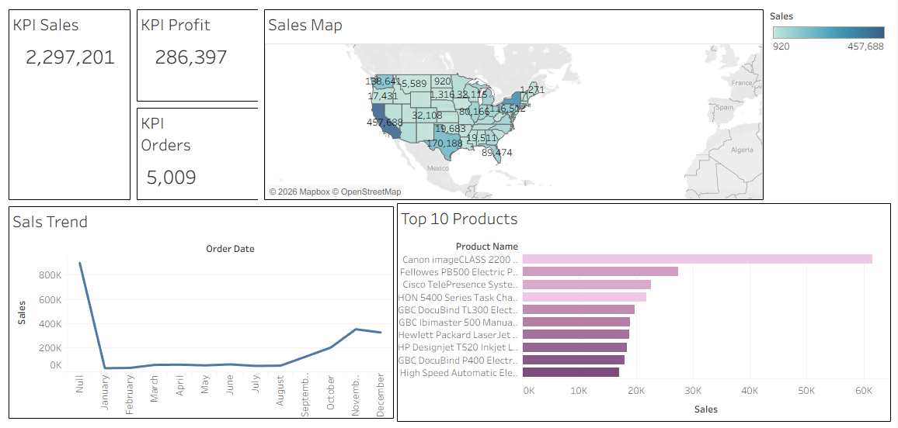

# Interactive Sales Dashboard Project (Tableau + Excel)

This project is an end-to-end data analysis and visualization project. It starts with a raw sales dataset, which is cleaned in Excel, and then used to build a fully interactive, filterable sales dashboard in Tableau.

##  dashboards
###  View the Live Interactive Dashboard

*[Click here to view the dashboard on Tableau Public](https://public.tableau.com/app/profile/tanisha.shirolkar/viz/Book1_17617318361880/Dashboard1?publish=yes)*

###  Dashboard Screenshot

###  Project Overview
This dashboard analyzes sales data to answer key business questions:
* What are the total sales, profit, and order counts?
* What is the sales trend over time (by quarter/month)?
* Which states and regions are the most profitable?
* What are the top 10 best-selling products?

---

### 🛠️ Tools Used
* *Excel 2013:* Used for all data cleaning and preparation (handling nulls, fixing data types, removing duplicates).
* *Tableau Public:* Used for all data visualization and dashboard creation.

---

### 📁 Project Files
* *[sales_data_clean.xlsx](sales_data_clean.xlsx)*: The cleaned Excel data file used as the data source for Tableau.
* *[sales_dashboard.twbx](sales_dashboard.twbx)*: The Tableau Packaged Workbook. You can download this file and open it with Tableau Public to see the full project build.
